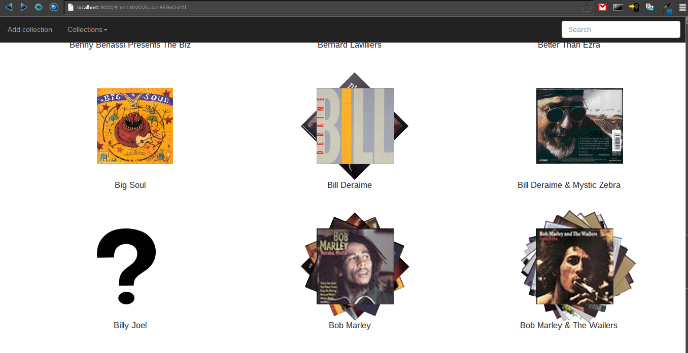

# MusicCollection

MusicCollection est, comme son nom l'indique, une application Web de gestion de votre bibliothèque musicale.
Le but est de pouvoir gérer votre bibliothèque le plus facilement possible.

Quel intérêt me direz vous, la plupart des lecteurs actuels gèrent les bibliothèques musicales.
C'est vrai, mais j'ai remarqué en changeant de lecteurs plusieurs fois, qu'ils ne gèrent pas les tags tous de la même
manière. Ce qui fait qu'en passant d'un lecteur à l'autre, vous pourriez ne pas voir les mêmes informations sur vos chansons.
Pire, certains lecteurs propriétaires (dont je tairais le nom), modifient les tags à leur sauce et ensuite, c'est le bordel :-(



## Prerequisites
* Node.js - Download and Install [Node.js](http://www.nodejs.org/download/). You can also follow [this gist](https://gist.github.com/isaacs/579814) for a quick and easy way to install Node.js and npm

### Tools Prerequisites
* NPM - Node.js package manager, should be installed when you install node.js.
* Bower - Web package manager, installing [Bower](http://bower.io/) is simple when you have npm:

```
$ npm install bower
or
$ sudo npm install -g bower
```

### Optional
* Grunt - Install [Grunt](http://gruntjs.com).

```
$ npm install grunt
or
$ sudo npm install -g grunt
```

## Additional Packages
* Express - Defined as npm module in the [package.json](package.json) file.
* Passport - Defined as npm module in the [package.json](package.json) file.
* AngularJS - Defined as bower module in the [bower.json](bower.json) file.
* Twitter Bootstrap - Defined as bower module in the [bower.json](bower.json) file.
* UI Bootstrap - Defined as bower module in the [bower.json](bower.json) file.
* NeDB - Defined as npm module in the [package.json](package.json) file.
* taglib - Defined as npm module in the [package.json](package.json) file.

## Quick Install
  The quickest way to get started with MusicCollection is to clone the project and utilize it like this:

  Clone project

    $ git clone https://github.com/Azema/MusicCollection.git
    $ cd MusicCollection

  Install dependencies:

    $ npm install
    $ bower install

  We recommend using [Grunt](https://github.com/gruntjs/grunt-cli) to start the server:

    $ grunt
    
  When not using grunt you can use:

    $ node server
    
  Then open a browser and go to:

    http://localhost:3000


## Troubleshooting
During install some of you may encounter some issues, most of this issues can be solved by one of the following tips.
If you went through all this and still can't solve the issue, feel free to contact us via the repository issue tracker or the links provided below.

#### Update NPM, Bower or Grunt
Sometimes you may find there is a weird error during install like npm's *Error: ENOENT*, usually updating those tools to the latest version solves the issue.

Updating NPM:
```
$ npm update -g npm
```

Updating Grunt:
```
$ sudo npm update -g grunt-cli
```

#### Cleaning NPM and Bower cache
NPM and Bower has a caching system for holding packages that you already installed.
We found that often cleaning the cache solves some troubles this system creates.

NPM Clean Cache:
```
$ npm cache clean
```

Bower Clean Cache:
```
$ bower cache clean
```

## Configuration
All configuration is specified in the [config](config/) folder, particularly the [config.js](config/config.js) file and the [env](config/env/) files.
Here you will need to specify your application name, database name.

### Environmental Settings

There are three environments provided by default, __development__, __test__, and __production__. Each of these environments has the following configuration options:
* __db__ - This is the names of the databases to use for songs, libraries and others data.

To run with a different environment, just specify NODE_ENV as you call grunt:

	$ NODE_ENV=test grunt

If you are using node instead of grunt, it is very similar:

	$ NODE_ENV=test node server

> NOTE: Running Node.js applications in the __production__ environment enables caching, which is disabled by default in all other environments.

## More Information
  * Go to the [wiki](https://github/Azema/MusicCollection/wiki/).

## License
(The MIT License)

Permission is hereby granted, free of charge, to any person obtaining
a copy of this software and associated documentation files (the
'Software'), to deal in the Software without restriction, including
without limitation the rights to use, copy, modify, merge, publish,
distribute, sublicense, and/or sell copies of the Software, and to
permit persons to whom the Software is furnished to do so, subject to
the following conditions:

The above copyright notice and this permission notice shall be
included in all copies or substantial portions of the Software.

THE SOFTWARE IS PROVIDED 'AS IS', WITHOUT WARRANTY OF ANY KIND,
EXPRESS OR IMPLIED, INCLUDING BUT NOT LIMITED TO THE WARRANTIES OF
MERCHANTABILITY, FITNESS FOR A PARTICULAR PURPOSE AND NONINFRINGEMENT.
IN NO EVENT SHALL THE AUTHORS OR COPYRIGHT HOLDERS BE LIABLE FOR ANY
CLAIM, DAMAGES OR OTHER LIABILITY, WHETHER IN AN ACTION OF CONTRACT,
TORT OR OTHERWISE, ARISING FROM, OUT OF OR IN CONNECTION WITH THE
SOFTWARE OR THE USE OR OTHER DEALINGS IN THE SOFTWARE.
